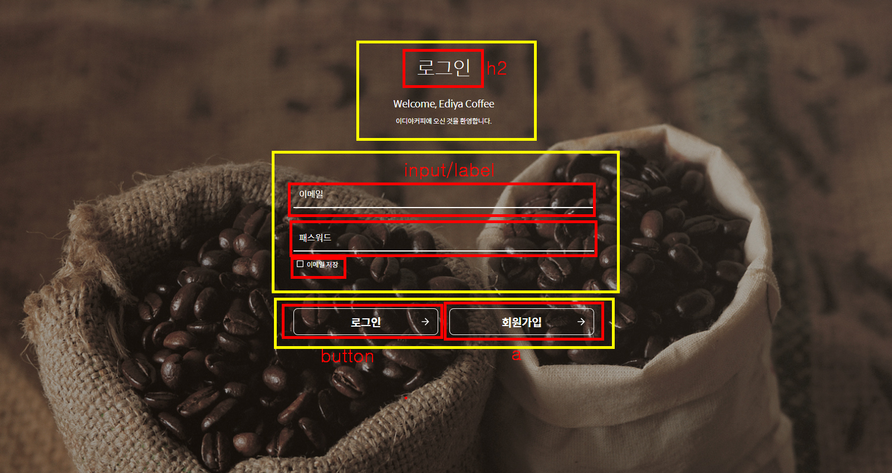
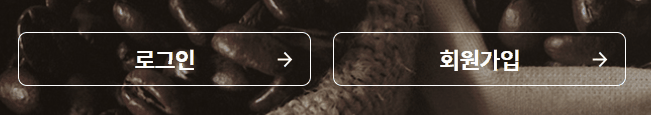

# 2주차 : 반응형 로그인 페이지 구현하기


## 1. HTML


- 헤더, 로그인, 버튼 3가지 섹션으로 나눴음
- 로그인 내부는 모두 label과 input 태그로 구성
- 하단 버튼은 로그인 submit 버튼과 회원가입 페이지로 이동가능한 a로 구성

## 2. 로그인 섹션


- focus 될 시 보더 색 변경 및 입력 할 수 있는 칸 표시할 수 있도록 트렌지션 효과 사용
- 하지만 focus가 해제되면 애니메이션 복구되는 버그 있음 -> 추후 수정해볼 예정
- 코드 : 
```
  .email-label,
  .password-label {
    font-size: 16px;
    font-weight: 400;
    letter-spacing: -0.26px;
    position: absolute;
    left: 0px;
    padding: 10px;
    transition: 0.5s;
  }

  .email input:valid~label,
  .email input:focus~label,
  .password input:valid~label,
  .password input:focus~label {
    transform: translateX(10px);
    transform: translateY(-15px);
    font-size: 13px;
  }

```

## 3. 체크박스 디자인 변경


- 기존 디자인이 아닌 지정 디자인 설정
- label에 :before 을 적용하여 이미지로 나타냄
- 기존 디자인은 display:none 설정
- 라벨과 연동하여 텍스트 눌러도 체크표시 활성화
- 코드 :

```
.checkbox input:checked+label::before {
  content: "";
  display: inline-block;
  width: 16px;
  height: 16px;
  background-image: url(./images/checked.png);
  float: left;
  margin-right: 4px;
}
```

## 4. 로그인 및 회원가입 버튼 효과



- 과제에 나와있는 효과와 조금 다르게 적용 (로그인 하얀색버튼 + 로그인 비밀번호 유효시 색 바뀜)
- 현재 실력으로는 구현 불가라 hover 효과로 다르게 적용해봄
- 나중에 수정해볼 예정

## 5. 반응형 웹사이트 구성

- 실력 부족으로 구현하지 못함
- 나중에 추가적으로 수정해볼 예정
- (min-width:600px)


## 6. 결과
- 유효성 검사, 반응형 사이트 등 아직 미흡한 부분이 많음
- 최대한 이미지와 비슷하게 구현해보려고 노력하면서 layout 사용 익힘 (flex)
- 조금 더 보완해서 완벽하게 구현해보고 싶음